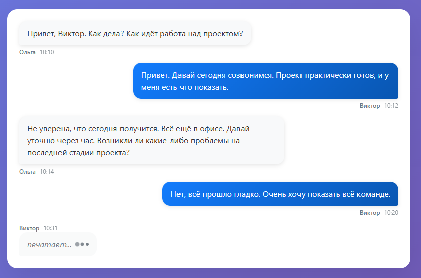

История чата
===

Необходимо вывести историю сообщений чата, используя библиотеку React. После загрузки данных и отрисовки чат должен выглядеть так:


## Данные сообщений чата

Данные для истории чата представляют собой _массив объектов_, каждый из которых представляет сообщение. У сообщения доступны следующие свойства:
- `id` — уникальный идентификатор сообщения, _строка_;
- `from` — автор сообщения, _объект_ с полем `name` (имя пользователя);
- `type` — тип сообщения, _строка_, варианты значений: `response`, `message`, `typing`;
- `time` — время публикации сообщения, _строка_;
- `text` — текст сообщения, _строка_, может отсутствовать для типа `typing`.

## Описание компонента

Для отображения истории создайте компонент `MessageHistory`, который принимает следующие атрибуты:
- `list` — список сообщений, _массив объектов_, по умолчанию пустой массив.

Если список сообщений пуст, то компонент не должен иметь какого-либо представления в DOM.

Компонент должен создавать на основе списка сообщений следующий HTML-код:
```html
<div class="chat-history">
  <div class="message-item message-response">
    <div class="message-header">
      <span class="message-author">Ольга</span>
      <span class="message-time">10:10</span>
    </div>
    <div class="message-bubble">
      Привет, Виктор. Как дела? Как идёт работа над проектом?
    </div>
  </div>
  <div class="message-item message-own">
    <div class="message-header">
      <span class="message-author">Виктор</span>
      <span class="message-time">10:12</span>
    </div>
    <div class="message-bubble">
      Привет. Давай сегодня созвонимся. Проект практически готов, и у меня есть что показать.
    </div>
  </div>
  <div class="message-item message-typing">
    <div class="message-header">
      <span class="message-author">Виктор</span>
      <span class="message-time">10:31</span>
    </div>
    <div class="typing-indicator">
      <span>печатает...</span>
    </div>
  </div>
</div>
```

При отображении сообщений необходимо использовать разные CSS классы в зависимости от типа сообщения:
- `message-own` — если тип сообщения равен `message` (сообщения текущего пользователя);
- `message-response` — если тип сообщения равен `response` (сообщения других пользователей);
- `message-typing` — если тип сообщения равен `typing` (индикатор печатания).

Для сообщений типа `typing` вместо текста сообщения отображается индикатор "печатает...".

## Пример использования

```jsx
const messages = [{
  id: 'chat-5-1090',
  from: { name: 'Ольга' },
  type: 'response',
  time: '10:10',
  text: 'Привет, Виктор. Как дела? Как идёт работа над проектом?'
}];

// в компоненте App:
return (
  <div className="chat-container">
    <MessageHistory list={messages} />
  </div>
);
```

Данные для сообщений:
```js
const messages = [{
  id: 'chat-5-1090',
  from: { name: 'Ольга' },
  type: 'response',
  time: '10:10',
  text: 'Привет, Виктор. Как дела? Как идёт работа над проектом?'
}, {
  id: 'chat-5-1091',
  from: { name: 'Виктор' },
  type: 'message',
  time: '10:12',
  text: 'Давай сегодня созвонимся. Проект практически готов, и у меня есть что показать.'
}, {
  id: 'chat-5-1092',
  from: { name: 'Ольга' },
  type: 'response',
  time: '10:14',
  text: 'Не уверена, что сегодня получится. Всё ещё в офисе. Давай уточню через час.'
}, {
  id: 'chat-5-1093',
  from: { name: 'Виктор' },
  type: 'message',
  time: '10:20',
  text: 'Нет, всё прошло гладко. Очень хочу показать всё команде.'
}, {
  id: 'chat-5-1094',
  from: { name: 'Виктор' },
  type: 'typing',
  time: '10:31'
}];
```

## Реализация

Необходимо отобразить историю сообщений чата, используя компонент `MessageHistory`.

Стили и пример разметки вы можете найти в папке [markup](./markup). Разметка дана для примера, вы можете реализовать её самостоятельно
